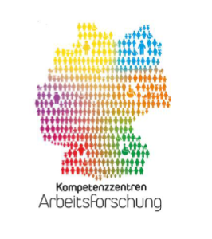

# PyForceSim
**A Discrete-Event Simulation Package for Reinforcement Learning Environments Based on Salabim**

## General

A library to provide a flexible interface to design simulation environments for manufacturing systems which can be easily integrated in reinforcement learning workflows, respects standards, and provides a convenient way to conduct differing experiments (especially different load scenarios to increase variance and enrich the learning experience for better generalisation).

> **The development was continued in a private and local repository. This is one of the reasons why the dependencies contain local paths.**

## Funding

The [K-M-I research and development project](https://kmi-netzwerk.org/kmi-projekt/) is funded as part of the “Future of Work: Regional Competence Centers for Labor Research – Artificial Intelligence” funding initiative within the “Innovations for Tomorrow's Production, Services, and Work” program of the German Federal Ministry of Research, Technology and Space (BMFTR) and is supervised by the Project Management Agency Karlsruhe (PTKA).

  
  

